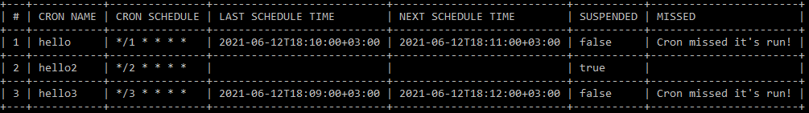

# kubectl-cron
Get crons data and crons missed runs in your cluster

## Usage example
`kubectl cron -n mynamespace` - outputs all crons in mynamespace namespace  
`kubectl cron -n mynamespace --format json` - outputs all crons in json format  
`kubectl cron -n mynamespace --missed` - outputs only crons that missed their scheduled runs

